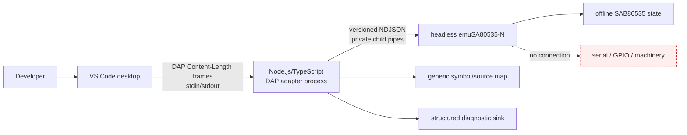
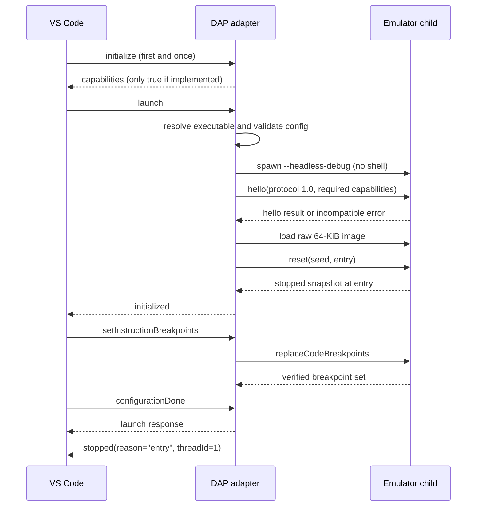
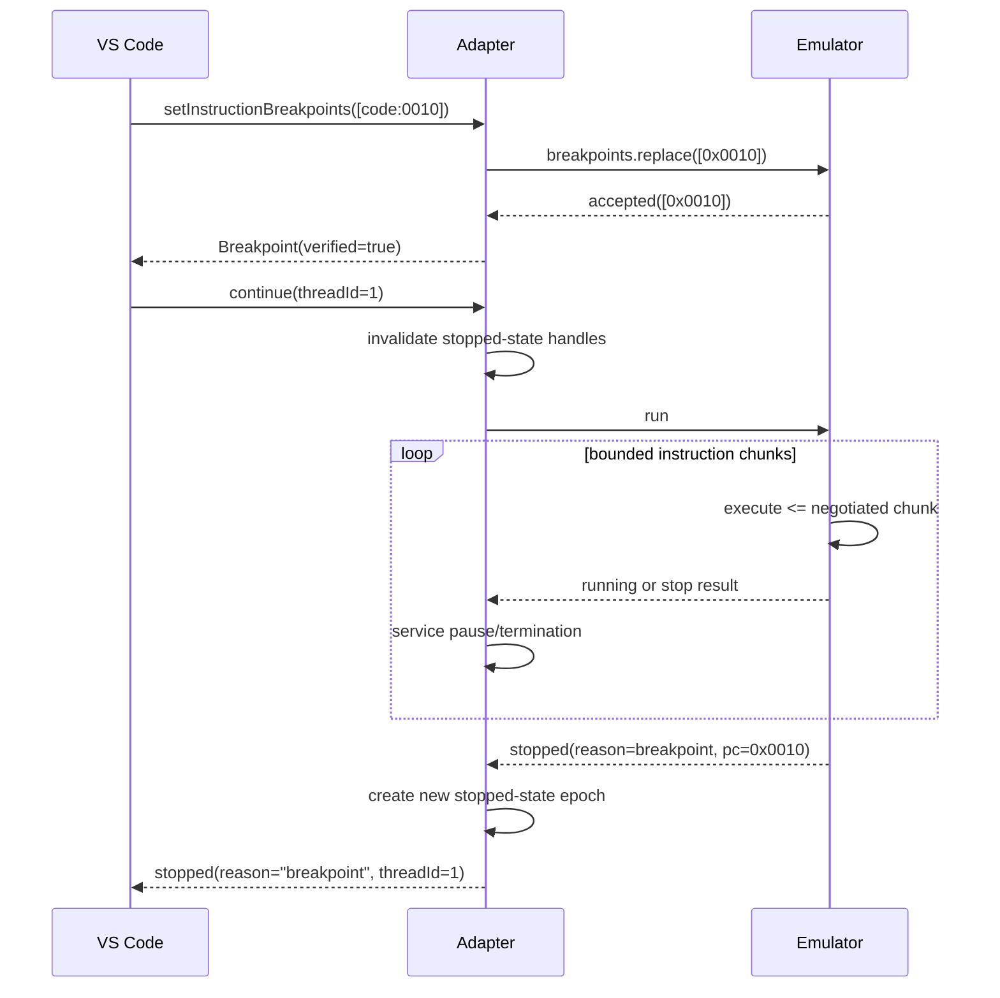
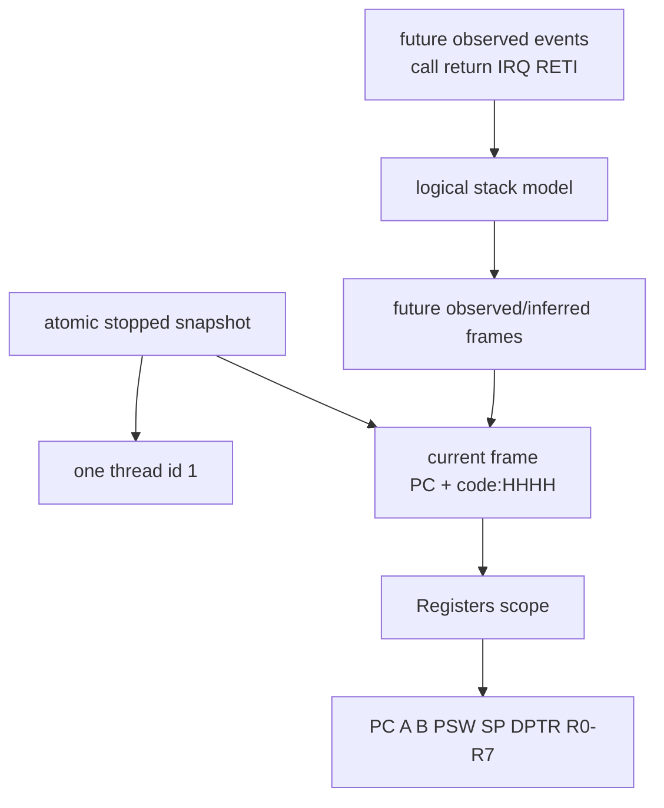
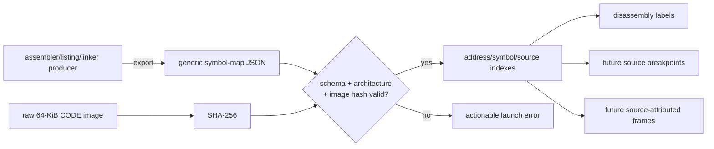
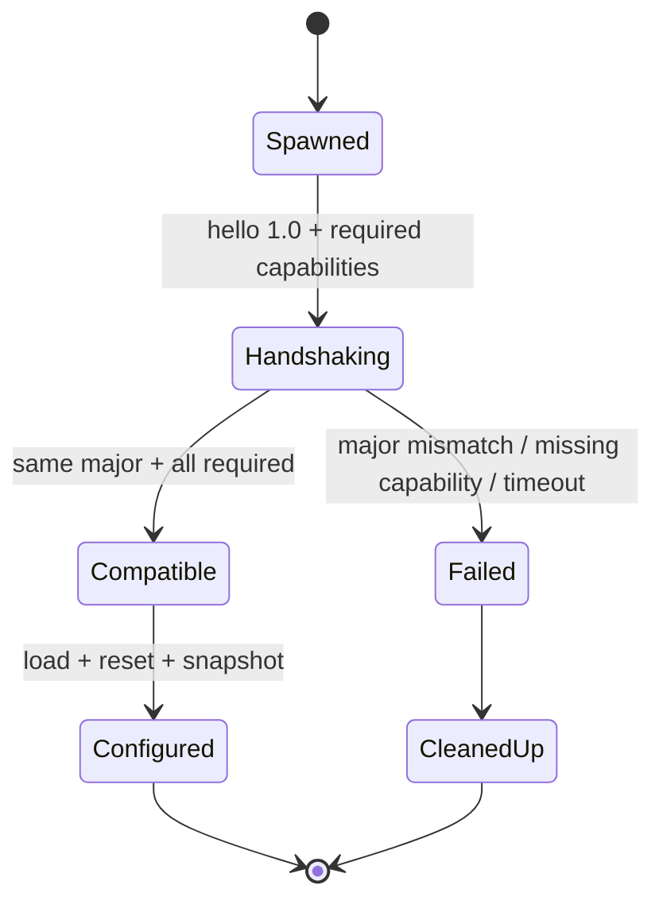
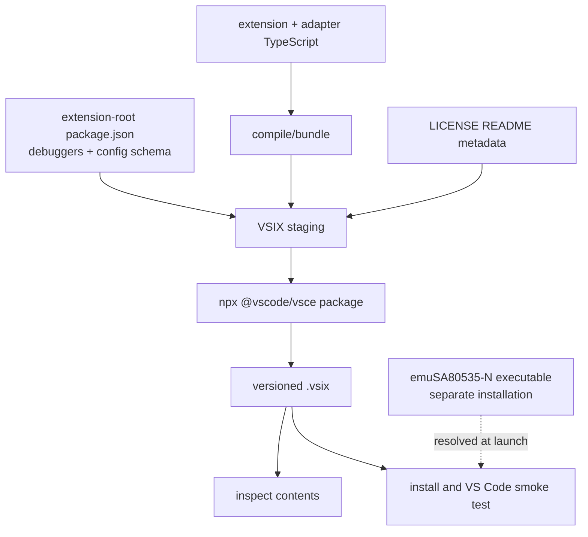

# DAP-ARCH-001 — Target architecture

**Traceability:** `A-001`–`A-008` realize `R-001`–`R-030`.  
**State:** Target only; diagrams do not claim implementation.

## System boundary (`A-001`)

VS Code owns the adapter process. The adapter owns a launch-mode emulator child.
Only the adapter's DAP stream is connected to VS Code. Emulator protocol stdout
must never be forwarded to DAP stdout; logs from both processes are routed to
stderr/diagnostic output after redaction.

## Component ownership

| Component | Repository/owner | Responsibility |
|---|---|---|
| Extension contribution/configuration | this repo, `extension/` | Manifest, debugger type/schema, settings, external adapter descriptor, VSIX contents |
| DAP implementation | this repo, `adapter/` | DAP sequencing, capabilities, handles, errors, requests/events |
| Emulator-control client | this repo, adapter boundary | Spawn, NDJSON correlation, handshake, timeout, lifecycle |
| Headless control server | `emuSA80535-N` | Stable versioned commands over stdio; deterministic CPU control |
| Symbol/source parser | this repo, adapter boundary | Validate generic schema and resolve CODE locations |
| Stack model | this repo using emulator events | Current frame in Slice 1; later observed logical frames |
| Logging/diagnostics | both, with adapter aggregation | Structured stderr records; correlation and redaction |
| Test fakes | this repo, test-only | Scriptable fake emulator and DAP integration harness |

## Launch lifecycle (`A-002`)

The adapter accepts exactly one DAP `initialize` per session. False/unsupported
capability flags are omitted or false. The launch response is not completed
until the child is compatible, configured, and stopped. `initialized` signals
that configuration requests are accepted; `configurationDone` closes that
phase.

On launch failure the adapter returns a failed DAP response and cleans up any
child. For a launch-owned session, `disconnect` terminates the child, closes
pipes, invalidates handles, replies, and emits `terminated`. An unexpected child
exit emits diagnostic output and `terminated` once.

## Breakpoint/continue/stop flow (`A-003`)

`setInstructionBreakpoints` is a global replacement, not an incremental update.
The emulator server returns the accepted set; the adapter preserves DAP order
and reports rejections. The negotiated maximum is at least one, and Slice-1
acceptance exercises exactly one; larger limits are compatible but not required.

Stop reason mapping is exact: entry→`entry`, code breakpoint→`breakpoint`,
step completion→`step`, user pause→`pause`, emulator exception→`exception`.
Halt/end or fatal transport terminates unless a reviewed future mapping applies.
Each transition to running expires all frame, scope, and variable handles.
Each new stop creates a new handle epoch.

## Current frame and future stack data flow (`A-004`)

Slice 1's `StackFrame` has a stable frame id for the stop epoch, a name such as
`0x0010`, `line: 0`, `column: 0`, and `instructionPointerReference:
"code:0010"`. It does not claim source or callers. Registers are read from the
same atomic snapshot as PC. Later logical frames are derived only from explicit
emulator events and carry observed/inferred/degraded metadata in presentation.

## Source and symbol mapping (`A-005`)

The parser belongs to the adapter and has no firmware-specific built-ins. In
Slice 1 no map is required; minimal disassembly is address-only. Near-term
source features require exact image identity and validated paths.

## Version and capability negotiation (`A-006`)

Compatibility is two-dimensional: protocol version and named capabilities.
Major mismatch is fatal. A newer minor is acceptable only when all required
Slice-1 capabilities and compatible message fields are present; unknown fields
are ignored. Emulator product version/commit is recorded for diagnostics but
does not replace protocol negotiation.

The adapter dependencies `@vscode/debugadapter` and
`@vscode/debugprotocol` were observed at 1.68.0 while the published DAP
specification is 1.71.0. Slice 1 must pin package versions and recheck the
required schema surfaces before coding rather than assuming those version
numbers move together.

## Packaging components (`A-007`)

The extension-root manifest will declare the debugger contribution, engine
floor, semantic version, entry points, and a prepublish build that bundles the
adapter into the VSIX. The executable emulator is excluded. CI must inspect the
archive and install/smoke-test it on Linux and Windows. Marketplace publisher
identity and publishing credentials remain Steering/release decisions.

## Runtime state and failure isolation (`A-008`)

The adapter has one session and one emulator child. It serializes state-changing
commands and correlates every emulator request/response. Each synchronous
emulator `run` request is bounded. If VS Code requests pause while a chunk is
outstanding, the adapter records a local pause intent, acknowledges the DAP
request, awaits that chunk, sends no next chunk, and reports the resulting pause
stop. No concurrent child request multiplexing is required. Timeouts are
command-specific and end in a known stopped or terminated state—never an
assumed state.

DAP request errors are failed DAP responses with structured details; output
events are diagnostics, not substitutes for failed responses. Malformed
emulator stdout is a protocol violation. Raw protocol payloads and environment
secrets are not logged.

## Architectural invariants

- The DAP stream and emulator-control stream never share a pipe.
- Debugger state is read only while stopped and from one snapshot.
- The one MCU instruction stream remains one DAP thread.
- No P1000 semantic enters adapter, protocol, schema, or fixtures.
- No emulator default-branch capability is claimed from unmerged PR #1.
- No host hardware endpoint is opened by this architecture.
