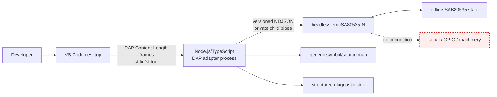
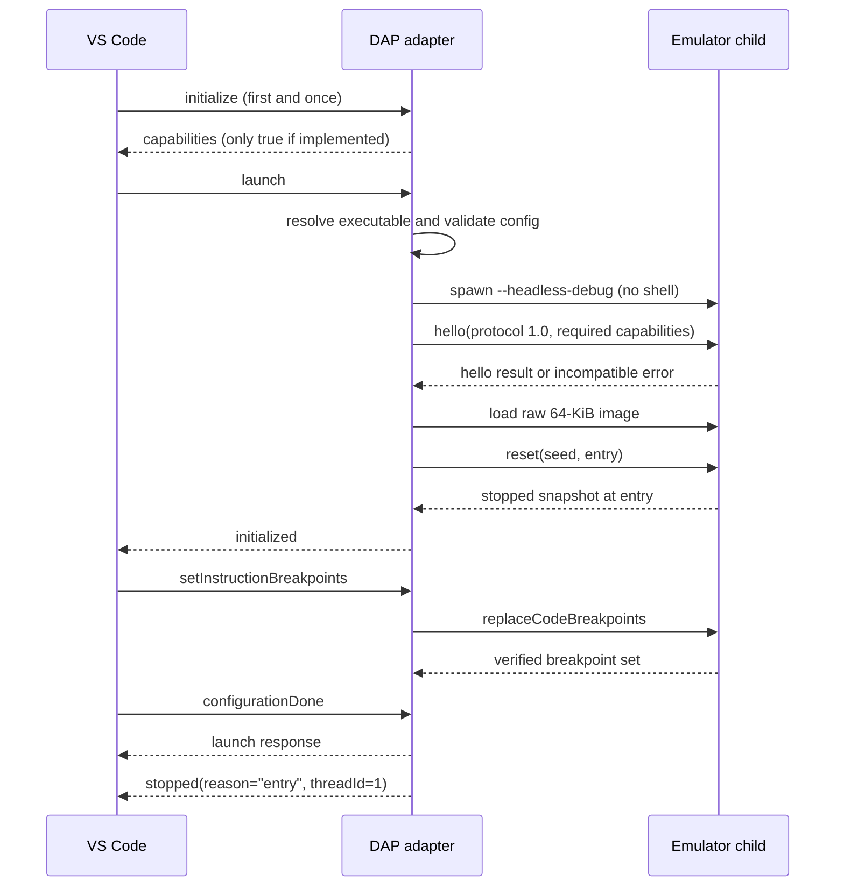
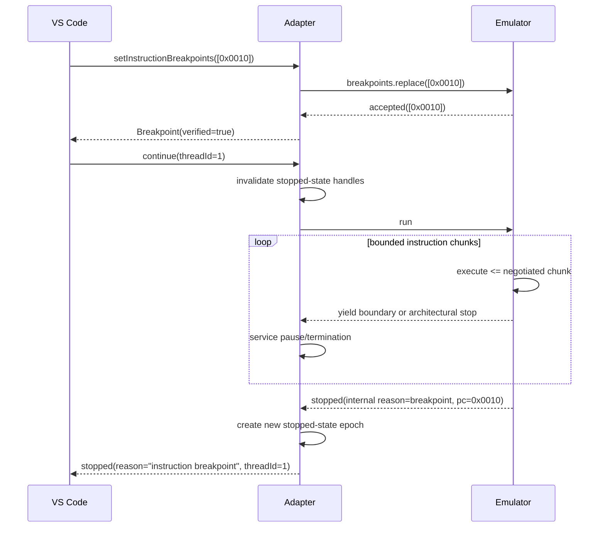
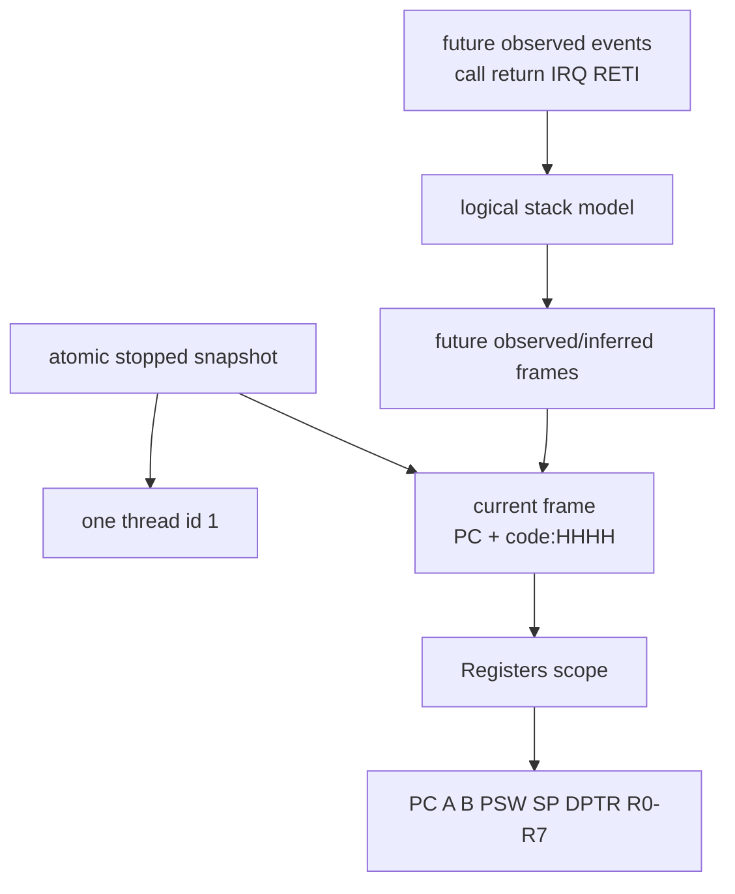
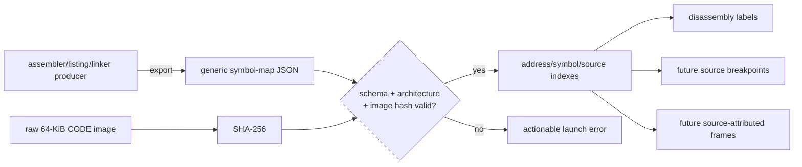
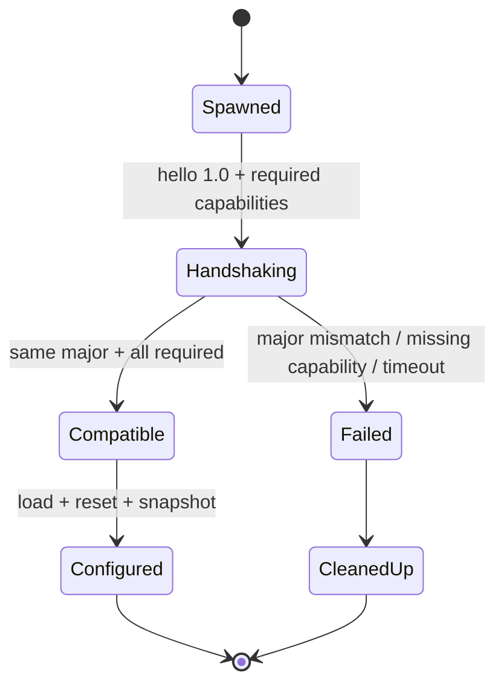
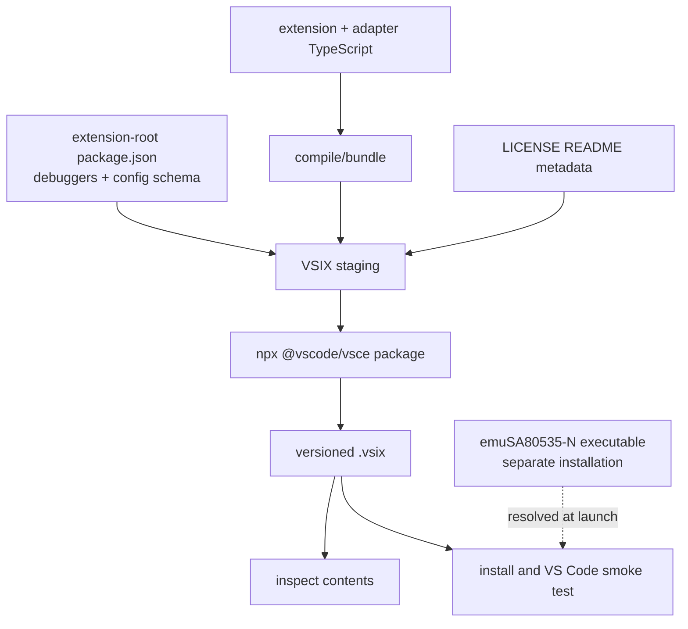

# DAP-ARCH-001 — Target architecture

**Traceability:** `A-001`–`A-008` realize `R-001`–`R-030`.
**State:** Slice-1 boundaries implemented and verified; diagrams remain target
authority for later-slice extensions

## System boundary (`A-001`)

VS Code owns the adapter process. The adapter owns a launch-mode emulator child.
Only the adapter's DAP stream is connected to VS Code. Emulator protocol stdout
must never be forwarded to DAP stdout; logs from both processes are routed to
stderr/diagnostic output after redaction.

## Component ownership

| Component | Repository/owner | Responsibility |
|---|---|---|
| Extension contribution/configuration | this repo, `extension/` | Manifest, debugger type/schema, settings, external adapter descriptor, VSIX contents |
| DAP implementation | this repo, `adapter/` | DAP sequencing, capabilities, handles, errors, requests/events |
| Emulator-control client | this repo, adapter boundary | Spawn, NDJSON correlation, handshake, timeout, lifecycle |
| Headless control server | `emuSA80535-N` | Stable versioned commands over stdio; deterministic CPU control |
| Symbol/source parser | this repo, adapter boundary | Validate generic schema and resolve CODE locations |
| Stack model | this repo using emulator events | Current frame in Slice 1; later observed logical frames |
| Logging/diagnostics | both, with adapter aggregation | Structured stderr records; correlation and redaction |
| Test fakes | this repo, test-only | Scriptable fake emulator and DAP integration harness |

### Current emulator dependency baseline

Current accepted `emuSA80535-N/master` at
[`d9f80eba`](https://github.com/Hans-Einar/emuSA80535-N/commit/d9f80eba172dd9d7281aaa9e5cfef461b6b9709b)
contains runtime merge `1a6aa397…` and implements the public no-curses
`emu-debug` 1.0 process boundary: NDJSON/version
handshake, atomic snapshots, exact `decodeCode`, replacement breakpoints,
bounded run/yield, exact step, and clean Windows/Linux lifecycle. Independent
real-runtime verification confirms that the adapter still consumes only this
versioned contract and never emulator private C layout. The earlier `a20815e`
core-only assessment remains historical planning evidence. IRQ frames/state
remain near-term and do not expand Slice 1.

## Launch lifecycle (`A-002`)

The adapter accepts exactly one DAP `initialize` per session. False/unsupported
capability flags are omitted or false. The launch response is not completed
until the child is compatible, configured, and stopped. `initialized` signals
that configuration requests are accepted; `configurationDone` closes that
phase.

On launch failure the adapter returns a failed DAP response and cleans up any
child. For a launch-owned session, `disconnect` terminates the child, closes
pipes, invalidates handles, replies, and emits `terminated`. An unexpected child
exit emits diagnostic output and `terminated` once.

## Breakpoint/continue/stop flow (`A-003`)

`setInstructionBreakpoints` is a global replacement, not an incremental update.
The emulator server returns the accepted set; the adapter preserves DAP order
and reports rejections. The negotiated maximum is at least one, and Slice-1
acceptance exercises exactly one; larger limits are compatible but not required.

Stop reason mapping keeps protocol vocabularies distinct: emulator-internal
entry→DAP `entry`, emulator-internal CODE `breakpoint`→DAP
`instruction breakpoint`, step completion→DAP `step`, adapter-local user
pause→DAP `pause`, and emulator exception→DAP `exception`. Halt/end or fatal
transport terminates unless a reviewed future mapping applies. Each transition
to running expires all frame, scope, and variable handles. Each new stop creates
a new handle epoch.

The address forms are also deliberately distinct. A frame and a DAP
`DisassembleArguments.memoryReference` use opaque `code:HHHH`. Returned
`DisassembledInstruction.address` uses numeric `0xHHHH`. When VS Code sends
that address back as `InstructionBreakpoint.instructionReference`, the adapter
accepts it, applies the optional signed byte offset exactly once, rejects a
result outside `0x0000`–`0xFFFF`, and canonicalizes the child request to a
uint16/code reference. The adapter also accepts its own opaque form and an
unsigned decimal DAP address; it does not accept other address spaces.

## Current frame and future stack data flow (`A-004`)

Slice 1's `StackFrame` has a stable frame id for the stop epoch, a name such as
`0x0010`, `line: 0`, `column: 0`, and `instructionPointerReference:
"code:0010"`. It does not claim source or callers. Registers are read from the
same atomic snapshot as PC. Later logical frames are derived only from explicit
emulator events and carry observed/inferred/degraded metadata in presentation.

## Source and symbol mapping (`A-005`)

The parser belongs to the adapter and has no firmware-specific built-ins. In
Slice 1 no map is required; minimal disassembly is address-only. Near-term
source features require exact image identity and validated paths.

## Version and capability negotiation (`A-006`)

Compatibility is two-dimensional: protocol version and named capabilities.
Major mismatch is fatal. A newer minor is acceptable only when all required
Slice-1 capabilities and compatible message fields are present; unknown fields
are ignored. Emulator product version/commit is recorded for diagnostics but
does not replace protocol negotiation.

The adapter dependencies `@vscode/debugadapter` and
`@vscode/debugprotocol` were observed at 1.68.0 while the published DAP
specification is 1.71.0. Slice 1 must pin package versions and recheck the
required schema surfaces before coding rather than assuming those version
numbers move together.

## Packaging components (`A-007`)

The extension-root manifest will declare the debugger contribution, engine
floor, semantic version, entry points, and a prepublish build that bundles the
adapter into the VSIX. The executable emulator is excluded. CI must inspect the
archive and install/smoke-test it on Linux and Windows. Marketplace publisher
identity and publishing credentials remain Steering/release decisions.

## Runtime state and failure isolation (`A-008`)

The adapter has one session and one emulator child. Two state axes are kept
separate:

- adapter logical session: `starting`, `stopped`, `running`, `terminating`, or
  `terminated`;
- child lifecycle/command state: `starting`, `idle-at-boundary`,
  `run-command-active`, `other-command-active`, `terminating`, or `exited`.

The child is not executing between requests. A successful synchronous `run`
response always leaves it `idle-at-boundary`. A `yield` is only a chunk-boundary
result, not an architectural stop. The adapter remains logically `running`,
keeps DAP stopped-state reads disabled, and sends the next chunk only after it
has checked that no pause or termination intent exists. An architectural stop
result (`breakpoint`, `exception`, or `halt`) also leaves the child idle, but
causes the adapter to stop or terminate according to the frozen mapping.

If VS Code requests pause while a chunk is outstanding, the adapter records a
local pause intent, acknowledges the DAP request before any stop event, awaits
that chunk, sends no next chunk, promotes the yielded boundary snapshot to a
new DAP stopped epoch, and emits one pause stop. If the request arrives after a
yield but before the next chunk is sent, the same transition uses that most
recent boundary directly. No child `pause` command or concurrent request
multiplexing is required.

Boundary snapshot validity is explicit. An architectural-stop/reset/step
snapshot becomes the current stopped epoch. A yield snapshot is private resume
state and is valid only while the child remains idle with the same loaded image;
it becomes a DAP snapshot only when pause promotes it. Sending another run,
resetting/loading, disconnecting, a timeout, malformed response, EOF, or child
exit invalidates it. On a command timeout there is no proven boundary: the
adapter must terminate/kill and reap the child rather than claim a stopped
state.

Disconnect sets termination intent. If a run is active, the adapter waits only
its bounded command timeout, schedules no next chunk, ignores any returned
snapshot for DAP presentation, then requests clean termination when possible or
kills the child. Pipes are closed, the child is reaped, handles are invalidated,
and exactly one DAP `terminated` event is emitted. All emulator commands are
serialized and every request/response is correlated.

DAP request errors are failed DAP responses with structured details; output
events are diagnostics, not substitutes for failed responses. Malformed
emulator stdout is a protocol violation. Raw protocol payloads and environment
secrets are not logged.

## Architectural invariants

- The DAP stream and emulator-control stream never share a pipe.
- Debugger state is read only while stopped and from one snapshot.
- The one MCU instruction stream remains one DAP thread.
- No P1000 semantic enters adapter, protocol, schema, or fixtures.
- Current emulator availability claims cite `d9f80eba…` evidence with accepted
  runtime merge `1a6aa397…`;
  `a20815e` and the original `5dc6812`/unmerged-PR-#1 observations remain dated
  historical planning evidence only.
- Merged C core seams are never substituted for the versioned process contract.
- No host hardware endpoint is opened by this architecture.
