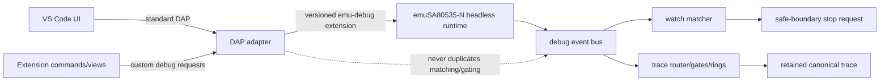
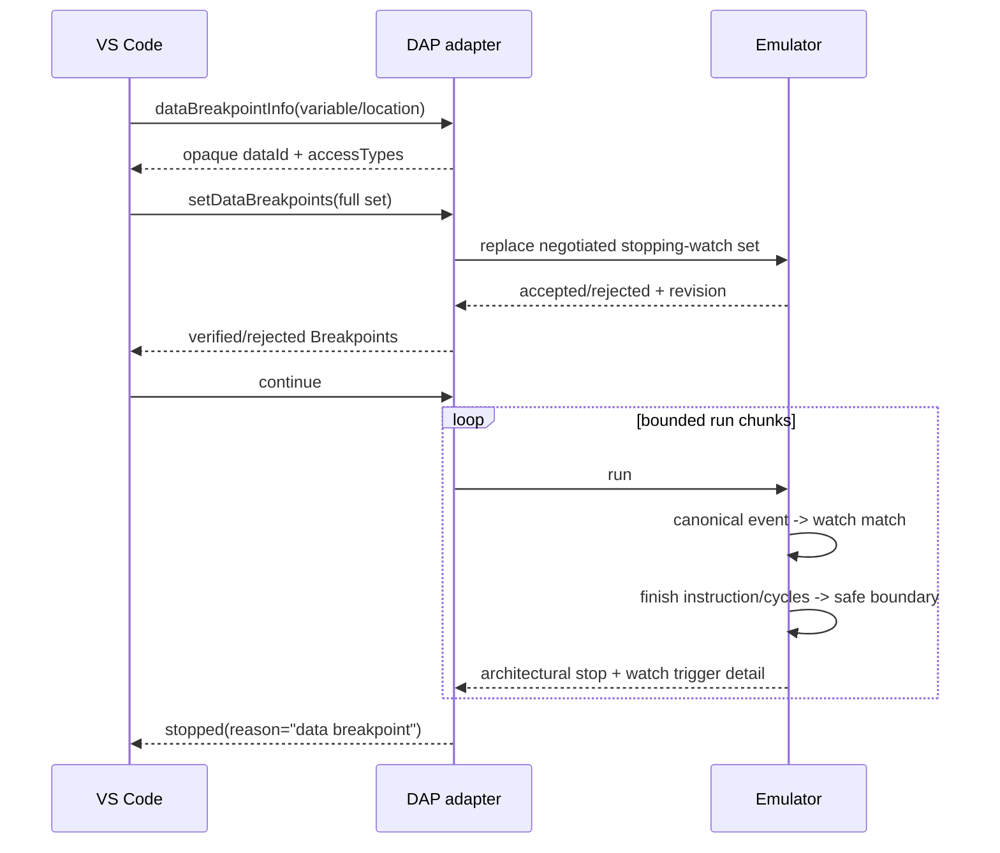
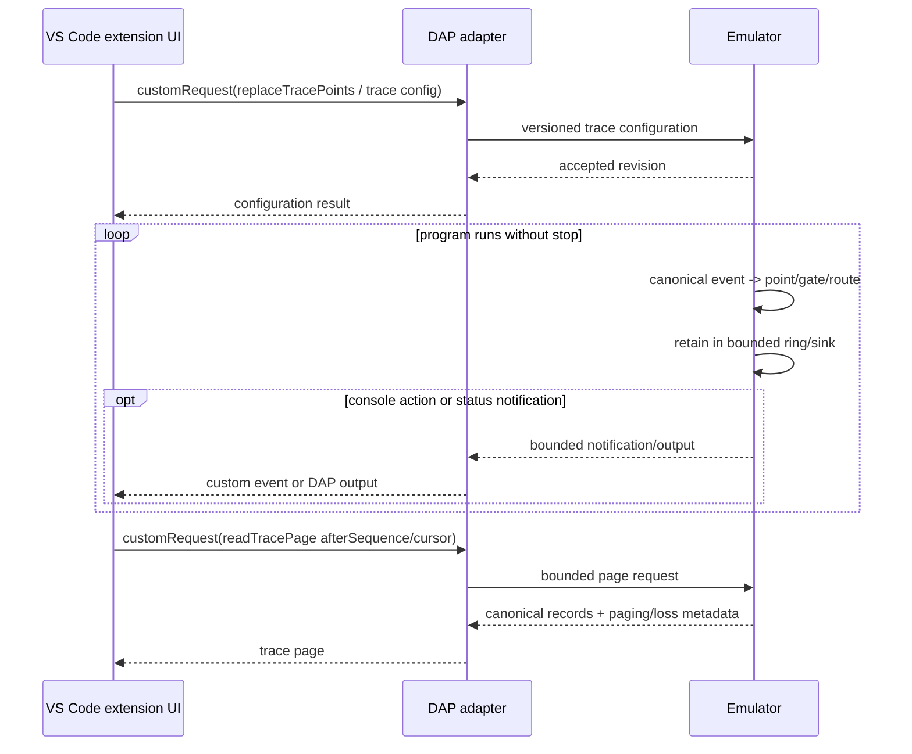

# DAP-ARCH-002 — Debug-point and trace integration architecture

**State:** planned post-Slice-1 architecture.  
**Extends:** `DAP-ARCH-001` without changing its verified launch/process boundary.

## Ownership invariant

The emulator owns canonical event production, matching, derived-event ordering, gate/routing semantics, retention/loss accounting and safe-boundary stop requests. The adapter owns protocol translation and VS Code presentation only.

## Standard DAP path: stopping watchpoints

A watchpoint is not implemented by inspecting memory after each DAP run chunk. The stop decision originates in the emulator runtime and is applied at its accepted safe boundary.

## Tracepoint path

Tracepoint activity does not create a DAP stop epoch and therefore does not invalidate frame/scope/variable handles merely because a trace record was produced.

## Adapter components

| Component | Responsibility |
|---|---|
| `dataBreakpoints` mapper | Standard DAP `dataBreakpointInfo`/`setDataBreakpoints`, opaque identity and verified/rejected mapping. |
| condition compiler | Compile the explicitly supported bounded DAP condition subset to emulator condition form; reject all other syntax. |
| debug-point client | Versioned optional emulator commands/capabilities; no private structs. |
| trace control service | Custom requests for tracepoints, traces, routes, gates and enable/disable operations. |
| trace page client | Non-destructive bounded retrieval using accepted cursor/after-sequence semantics. |
| trace presenter | Render console actions through DAP `output`; expose canonical pages/status to extension UI. |
| custom-event bridge | Low-volume trace-available/loss/suppression/status notifications only. |

## Capability negotiation

`emu-debug` 1.0 base capabilities remain required for Slice-1 behavior. Debug-point support is optional and additive.

The adapter shall distinguish at least these semantic capability groups once the emulator contract freezes exact names:

- stopping watchpoint configuration;
- canonical trace configuration;
- trace ring/page retrieval;
- trace status/loss notifications;
- bounded point-condition support.

The exact capability strings and command names are not frozen by this DAP document; they must be copied from the accepted emulator wire-extension authority. Missing optional capabilities disable only the corresponding Slice-2 UI/features and must not break launch, instruction breakpoints, disassembly, registers, continue/pause or step.

## Data identity

DAP `dataId` is opaque to VS Code. The adapter owns a session table mapping each `dataId` to a canonical watchable target/specification. A `dataId` shall contain no raw C pointer or lifetime-sensitive emulator token.

The stable conceptual target includes:

- address space (`iram-lower`, `iram-upper`, `sfr`, `xdata`, and later other accepted spaces);
- inclusive address/range when supported;
- allowable access kinds;
- optional byte/bit width metadata.

The adapter may encode this into a bounded opaque string or keep a handle table, but the semantic target is validated before sending it to the emulator.

## Stop details

On a watchpoint stop the adapter creates a normal stopped epoch from the emulator's atomic safe-boundary snapshot. Trigger metadata should be retained adapter-side for presentation and diagnostics, including when available:

- watch/point id;
- canonical source event sequence;
- executing PC responsible for the access;
- address space/address/access;
- old/new value known/value fields;
- matched action/condition summary.

The DAP stop reason remains the standard `data breakpoint`. Rich details may be surfaced through breakpoint metadata, variables, a custom trace/debug-point view or diagnostic output; they must not require a non-standard stopped reason.

## Trace transport and backpressure

Raw canonical trace records are not pushed synchronously one-by-one through DAP as the authoritative path. The emulator's bounded retention is authoritative and reports overwrite/loss/suppression explicitly.

The extension uses page retrieval. Custom events are edge notifications such as `traceAvailable` or status changes and may be coalesced. Console trace actions use bounded `output` events because they are explicitly a presentation action, not trace retention.

This prevents host UI speed from becoming part of emulated execution timing.

## Existing breakpoint compatibility

`setInstructionBreakpoints -> replaceCodeBreakpoints` remains a supported Slice-1 path. If the emulator later implements that public command through its common debug-point runtime, the adapter is unaffected. No DAP migration may require users to convert existing CODE breakpoints into a custom trace/watch configuration.

## Future logical stack dependency

Accepted `control.call`, `control.return`, `interrupt.enter`, and `interrupt.exit` canonical events become the preferred input for later logical stack/step-over/step-out work. The adapter should subscribe/retrieve the minimum required event state rather than decode every opcode itself.

That consumer is not part of Slice 2.

## Failure isolation

Invalid point configuration, unsupported condition syntax, stale revision, trace-page range/cursor errors and trace loss are debugger feature errors, not emulator process corruption. They shall return failed DAP/custom responses while preserving the previous accepted configuration whenever the emulator contract specifies atomic replacement.

Malformed wire protocol, timeout, EOF and child crash continue to use the Slice-1 fatal process/lifecycle rules.
