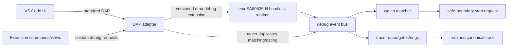
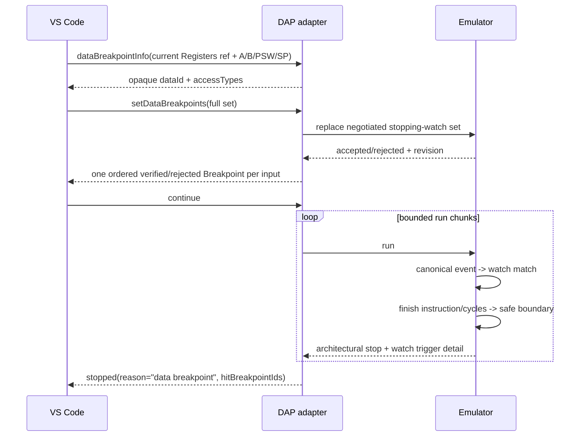
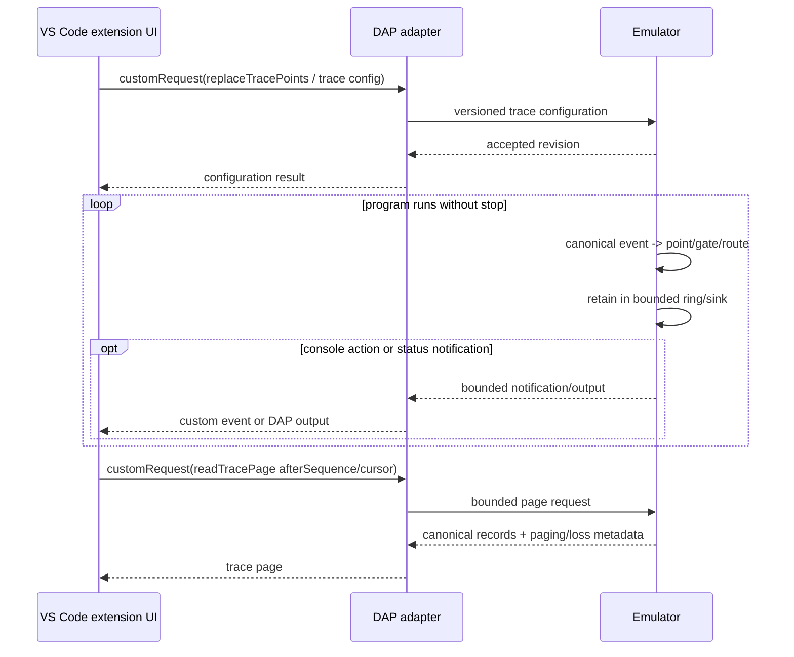

# DAP-ARCH-002 — Debug-point and trace integration architecture

**Traceability:** `A-009` realizes `R-032`–`R-051` and constrains `SPR-002`.
**State:** planned post-Slice-1 architecture.
**Extends:** `DAP-ARCH-001` without changing its verified launch/process boundary.

## Ownership invariant

The emulator owns canonical event production, matching, derived-event ordering, gate/routing semantics, retention/loss accounting and safe-boundary stop requests. The adapter owns protocol translation and VS Code presentation only.

## Standard DAP path: stopping watchpoints

A watchpoint is not implemented by inspecting memory after each DAP run chunk. The stop decision originates in the emulator runtime and is applied at its accepted safe boundary.

## Tracepoint path

Tracepoint activity does not create a DAP stop epoch and therefore does not invalidate frame/scope/variable handles merely because a trace record was produced.

The native VS Code path is the Variables view data-breakpoint action on one of
the four exact register children. It is not an extension-only Add Watchpoint
command. Full memory views are not a prerequisite for this first vertical.

## Adapter components and slice allocation

| Component | Planned slice | Responsibility |
|---|---|---|
| `dataBreakpoints` mapper | 2A | Standard DAP `dataBreakpointInfo`/`setDataBreakpoints`, exact SFR-origin resolution, opaque token table, ordered response and installed-id mapping. |
| condition compiler | 2A only if exact subset accepted | Compile only the accepted bounded DAP subset to emulator condition form; otherwise reject all non-empty conditions. |
| debug-point client | 2A minimum, later extended by 2B | Versioned optional emulator integration; no private structs or provisional wire names. |
| trace control service | 2B | Custom controls for tracepoints, sessions, routes, gates and enable/disable operations. |
| trace page client | 2B | Non-destructive bounded retrieval using accepted cursor/after-sequence semantics. |
| trace presenter | 2B | Render console actions through DAP `output`; expose canonical pages/status to extension UI. |
| custom-event bridge | 2B | Low-volume trace-available/loss/suppression/status notifications only. |

## Capability negotiation

`emu-debug` 1.0 base capabilities remain required for Slice-1 behavior. Debug-point support is optional and additive.

The adapter shall distinguish at least these semantic capability groups once the emulator contract freezes exact names:

- stopping watchpoint configuration;
- canonical trace configuration;
- trace ring/page retrieval;
- trace status/loss notifications;
- bounded point-condition support.

The exact capability strings and command names are not frozen by this DAP document; they must be copied from the accepted emulator wire-extension authority. Missing optional capabilities disable only the corresponding Slice-2 UI/features and must not break launch, instruction breakpoints, disassembly, registers, continue/pause or step.

## Data discovery and installed identities

DAP `dataId` is opaque to VS Code. Slice 2A owns a bounded session table that
maps each token to a canonical watchable target/specification plus the current
target/configuration generation. A `dataId` contains no raw C pointer, emulator
identity, address encoding promised to clients, or lifetime-sensitive private
token. It reports `canPersist: false` and is never reused across sessions.

The conceptual target includes:

- address space (`iram-lower`, `iram-upper`, `sfr`, `xdata`, and later other accepted spaces);
- inclusive address/range when supported;
- allowable access kinds;
- optional byte/bit width metadata.

Slice 2A admits only these targets:

| Registers child | Space | Inclusive range | Width |
|---|---|---|---|
| `A` | SFR | `0xe0..0xe0` | 1 byte |
| `B` | SFR | `0xf0..0xf0` | 1 byte |
| `PSW` | SFR | `0xd0..0xd0` | 1 byte |
| `SP` | SFR | `0x81..0x81` | 1 byte |

`dataBreakpointInfo` produces a token only for a stopped session, the current
Registers `variablesReference`, and one exact table name. A stale/foreign
nonzero variables reference or malformed argument fails the request clearly.
A well-formed current Registers origin naming `PC`, `DPTR`, `R0`–`R7`, or any
other non-exact child succeeds with `dataId: null`; so does a well-formed
`frameId`/expression or address/byte-range origin. The adapter does not infer a
target. Slice 2A leaves `supportsDataBreakpointBytes` false/omitted.

The Registers handle is stop-epoch-scoped. A resolved `dataId` is instead
session- and target-generation-scoped so the static SFR token is not coupled
to the stop epoch. Resume/new-stop does not change its target generation.
Restart, process replacement, variant/configuration change, load, reset,
disconnect, or a new session invalidates outstanding tokens conservatively;
the exact accepted emulator lifecycle may later narrow only the load/reset
rule. Explicit trace clear and ordinary trace mutation do not affect the data
token domain.

An installed watch has separate identities: its positive integer DAP
`Breakpoint.id`, the emulator's public correlation identity, and the accepted
configuration revision. Token expiry alone does not mutate it. A successful
replacement retains a DAP id only for an unchanged normalized watch
(target/access/condition/hit condition), retires removed/changed ids, and does
not reuse retired ids in that debug session. The exact revision representation
must remain lossless and changes only as reported by a successful accepted
emulator mutation.

Before any mutation, the adapter resolves every source token, validates
generation/access/condition, and detects malformed or duplicate inputs. If any
input fails, or the emulator rejects the atomic proposal, the prior installed
set, correlation mapping, and revision remain unchanged. The DAP response has
one `Breakpoint` for every input in the same order. Each rejected result has
`verified: false` plus actionable `message`/`reason`; transaction peers explain
that atomic replacement was not applied.

Lifecycle effects remain separated:

| Event | Discovery token | Installed DAP watch configuration |
|---|---|---|
| resume or new stopped epoch | retained in same target generation | unchanged |
| successful `setDataBreakpoints` | retained if generation still current | atomically replaced; empty set explicitly clears |
| failed/stale replacement | unchanged except stale lookup remains unusable | unchanged, including revision and ids |
| trace clear/configuration | unchanged | unchanged |
| reset/load before exact lifecycle freeze | invalidated by generation change | reconciled only from the accepted emulator lifecycle result; token expiry alone performs no mutation |
| restart/process/variant replacement | invalidated | ended or reconciled only by explicit new-process configuration |
| disconnect/new session | destroyed | destroyed; ids are never carried to another session |

## Stop details

On a watchpoint stop the adapter creates a normal stopped epoch from the emulator's atomic safe-boundary snapshot. Trigger metadata should be retained adapter-side for presentation and diagnostics, including when available:

- watch/point id;
- canonical source event sequence;
- executing PC responsible for the access;
- address space/address/access;
- old/new value known/value fields;
- matched action/condition summary.

The DAP stop reason remains the standard `data breakpoint`. Where the accepted
emulator result supplies sufficient public trigger correlation, the adapter
maps every trigger to the installed positive integer DAP `Breakpoint.id` and
sets `hitBreakpointIds`; private emulator identities never leak. Rich details
may be surfaced through breakpoint metadata, variables, a later custom
trace/debug-point view or diagnostic output; they must not require a
non-standard stopped reason.

## Trace transport and backpressure

Raw canonical trace records are not pushed synchronously one-by-one through DAP as the authoritative path. The emulator's bounded retention is authoritative and reports overwrite/loss/suppression explicitly.

The extension uses page retrieval. Custom events are edge notifications such as `traceAvailable` or status changes and may be coalesced. Console trace actions use bounded `output` events because they are explicitly a presentation action, not trace retention.

This prevents host UI speed from becoming part of emulated execution timing.

## Existing breakpoint compatibility

`setInstructionBreakpoints -> replaceCodeBreakpoints` remains a supported Slice-1 path. If the emulator later implements that public command through its common debug-point runtime, the adapter is unaffected. No DAP migration may require users to convert existing CODE breakpoints into a custom trace/watch configuration.

## Future logical stack dependency

Accepted `control.call`, `control.return`, `interrupt.enter`, and `interrupt.exit` canonical events become the preferred input for later logical stack/step-over/step-out work. The adapter should subscribe/retrieve the minimum required event state rather than decode every opcode itself.

That consumer is not part of Slice 2.

## Failure isolation

Invalid point configuration, unsupported condition syntax, stale revision, trace-page range/cursor errors and trace loss are debugger feature errors, not emulator process corruption. They shall return failed DAP/custom responses while preserving the previous accepted configuration whenever the emulator contract specifies atomic replacement.

Malformed wire protocol, timeout, EOF and child crash continue to use the Slice-1 fatal process/lifecycle rules.
