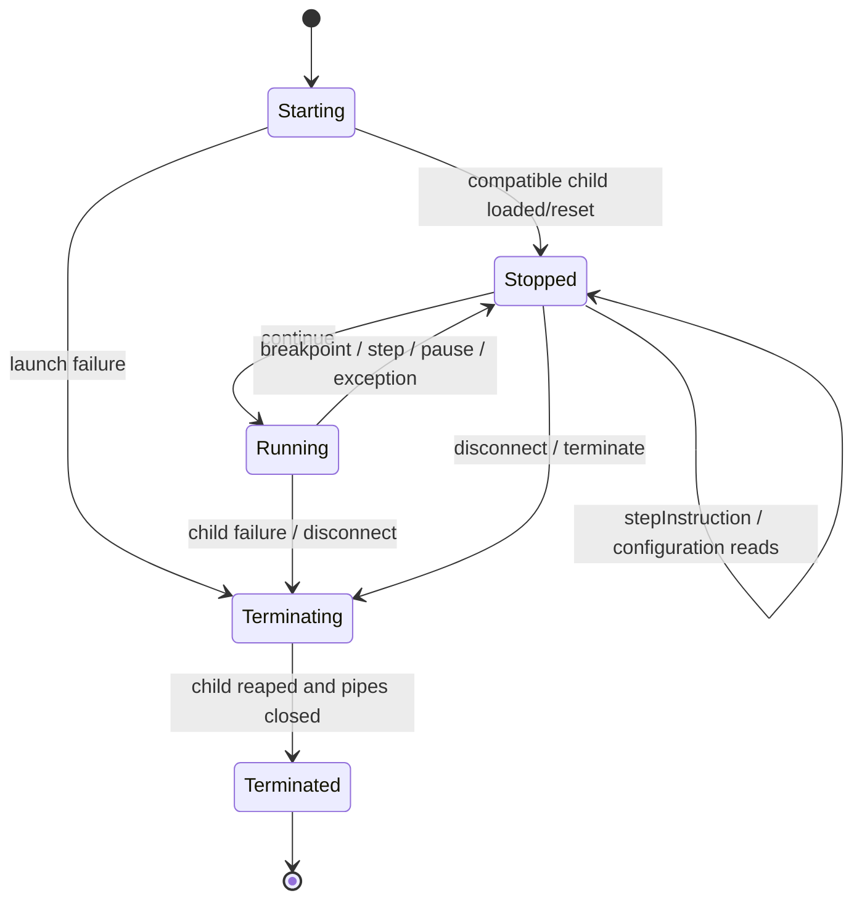
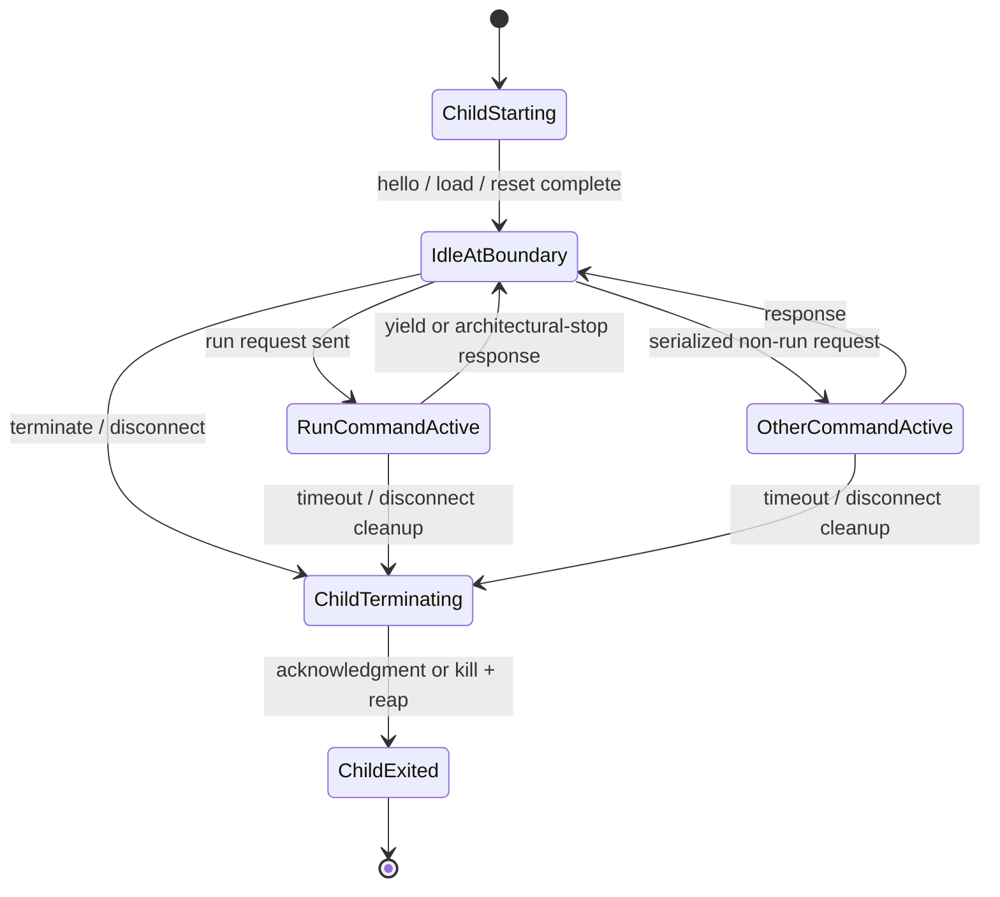

# DAP-DES-001 — Documentation-level design

**Traceability:** `D-001`–`D-010` refine `A-001`–`A-008`.  
**State:** Target interface design only; code blocks are contracts/examples,
not implementation files.

## Proposed source layout (`D-001`)

```text
extension/
  src/extension.ts                 # activation and adapter descriptor
  package.json                     # extension-root manifest (location to freeze)
adapter/
  src/session.ts                   # DAP session
  src/emulatorClient.ts            # NDJSON child client
  src/state.ts                     # state machine and stop epochs
  src/breakpoints.ts               # replacement table
  src/memoryReference.ts           # canonical references
  src/disassembly.ts               # decode response mapping
  src/symbols/                     # generic schema/parser/indexes
protocol/
  EMU_DEBUG_API_REQUIREMENTS.md
test-fixtures/
  firmware/                        # synthetic exact 64-KiB raw images
  fake-emulator/                   # protocol test double
```

This is a future layout, not authorization to create these files in Issue #1.
Before implementation, Steering must freeze whether `extension/` is the package
root or a repository-root manifest owns packaging.

## Launch configuration (`D-002`)

Proposed contribution type: `emuSA80535`.

```json
{
  "type": "emuSA80535",
  "request": "launch",
  "name": "Launch SAB80535 firmware",
  "program": "${workspaceFolder}/firmware.bin",
  "entryAddress": "0x0000",
  "resetSeed": 525109,
  "emulatorPath": "/optional/explicit/path/emu80535-headless",
  "symbolMap": "${workspaceFolder}/firmware.emu-symbols.json",
  "stopOnEntry": true,
  "trace": "off"
}
```

`program` is required and must be exactly 65,536 bytes in Slice 1.
`entryAddress` is a canonical 16-bit numeric string; `resetSeed` is an unsigned
32-bit integer; `stopOnEntry` is required to be true initially. `emulatorPath`
and `symbolMap` are optional. Executable resolution is: launch value, workspace
setting `emuSA80535.emulatorPath`, then platform `PATH`. No shell expansion or
auto-download occurs. Attach configurations are rejected as unsupported.

## Emulator-control envelope (`D-003`)

Transport is UTF-8 NDJSON: exactly one JSON object per line, no embedded raw
newlines, maximum negotiated record size, request ids unique within a process.
stdout is protocol-only and stderr is structured diagnostics.

```ts
type Request = {
  type: "request"; id: number; command: string; arguments?: object;
};
type Response = {
  type: "response"; id: number; command: string; success: boolean;
  body?: object; error?: ControlError;
};
type Event = {
  type: "event"; event: "stopped" | "output" | "terminated"; body?: object;
};
type ControlError = {
  code: string; message: string; retryable: boolean; data?: object;
};
```

Minimum request surface frozen for Slice 1:

| Command | Arguments | Successful body / semantics |
|---|---|---|
| `hello` | client protocol `1.0`, required capabilities | server protocol/product/commit, limits, capability names |
| `load` | absolute raw image path, format `raw-code-64k`, expected SHA-256 | loaded image SHA-256 |
| `reset` | seed, entry address, stop `entry` | atomic stopped snapshot |
| `getState` | none | child lifecycle/command state plus the latest valid instruction-boundary snapshot when idle |
| `decodeCode` | reference CODE address, signed byte offset, signed instruction offset, instruction count | exactly the requested number of ordered valid decode records and/or explicit invalid one-byte predecessor placeholders, or a structured range error |
| `replaceCodeBreakpoints` | full array of 16-bit addresses | accepted/rejected arrays and limit |
| `run` | chunk instruction limit | `yield` plus boundary snapshot, or architectural stop result; one bounded chunk only |
| `stepInstruction` | none | exactly one completed instruction and `step` snapshot |
| `terminate` | none | clean shutdown acknowledgment |

Pause is adapter-local: while one synchronous `run` chunk is outstanding, the
adapter records the DAP pause intent, acknowledges DAP pause before the stop
event, awaits the chunk, sends no next chunk, and emits a pause stop using the
returned boundary. Between run requests the child is idle at an instruction
boundary even though the adapter remains logically running. The child protocol
has no Slice-1 `pause` command and does not need concurrent request
multiplexing. An unbounded child `run` is non-conforming.

Example handshake:

```json
{"type":"request","id":1,"command":"hello","arguments":{"protocol":{"major":1,"minor":0},"requiredCapabilities":["rawCode64k","deterministicReset","snapshotBasicRegisters","decodeCode","replaceCodeBreakpoints","boundedRun","stepInstruction"]}}
```

```json
{"type":"response","id":1,"command":"hello","success":true,"body":{"protocol":{"major":1,"minor":0},"product":"emuSA80535-N","productVersion":"candidate","commit":"...","capabilities":["rawCode64k","deterministicReset","snapshotBasicRegisters","decodeCode","replaceCodeBreakpoints","boundedRun","stepInstruction"],"limits":{"maxBreakpoints":1,"maxRunChunkInstructions":1024,"maxDisassembleInstructions":256,"maxRecordBytes":65536}}}
```

`snapshotBasicRegisters` returns `pc`, `a`, `b`, `psw`, `sp`, `dptr`, `r[8]`,
variant, instruction counter, and stop reason from one instruction boundary.
No server response exposes pointers or private structure layout.

## Adapter state machine (`D-004`)



This diagram is the adapter's logical DAP state, not the state of a
synchronous child process. The child uses a separate lifecycle/command state:



A `run` yield returns a boundary snapshot and moves the child to
`IdleAtBoundary`; it does not move the adapter out of `Running`. Before sending
the next chunk, the adapter checks pause and termination intent. With neither
intent, it invalidates the yielded snapshot by sending the next `run`. With
pause intent, it sends no command, promotes that boundary into a new stop
epoch, moves to `Stopped`, and emits the pause stop after the already-sent pause
response. With termination intent, it never exposes the yield snapshot and
enters cleanup. An architectural stop instead creates the new stop epoch
immediately. A timeout, malformed response, EOF, or child exit proves no safe
boundary, invalidates every snapshot, and terminates the session.

Allowed reads (`threads`, `stackTrace`, `scopes`, `variables`, `disassemble`)
require `Stopped`, except disassembly may use immutable loaded CODE if identity
is unchanged. `continue`/`stepIn` require `Stopped`; repeated pause while stopped
returns a failed `notRunning` response. Request failures never mutate the state
unless cleanup is the documented result.

Every stop increments `stopEpoch`. Frame/scope/variable handles encode that
epoch and expire on resume; stale handles fail rather than returning new-state
data under an old identity. A yield snapshot is private scheduler state, valid
only at the current child boundary and for the current image. It is never
readable through DAP unless pause promotes it to the stopped epoch.

## DAP mappings (`D-005`)

| DAP request/event | Slice-1 mapping |
|---|---|
| `initialize` | Once; respond with `supportsConfigurationDoneRequest`, `supportsInstructionBreakpoints`, `supportsDisassembleRequest`, and `supportsSteppingGranularity`; omit unsupported flags |
| `launch` | Resolve/spawn/hello/load/reset; send `initialized`; await configuration |
| `setInstructionBreakpoints` | Accept `code:HHHH`, `0x` hexadecimal, or unsigned decimal CODE references; apply each signed byte offset once, range-check, canonicalize, globally replace the emulator table, and return DAP-order results |
| `configurationDone` | Complete launch and emit entry stop |
| `threads` | `[{id: 1, name: "SAB80535"}]` |
| `stackTrace` | One current frame with required id/name/line/column and `instructionPointerReference` |
| `scopes` | One read-only `Registers` scope |
| `variables` | PC, A, B, PSW, SP, DPTR, R0–R7; values formatted hex |
| `disassemble` | Resolve opaque `code:` reference and byte offset, apply instruction offset as designed, and return exactly the requested count with DAP-numeric `0xHHHH` addresses and explicit invalid placeholders where predecessor boundaries are unknown |
| `continue` | Respond to the client request, then schedule repeated bounded `run`; a yield leaves the child idle while the adapter remains running; do not emit `continued` for this normal requested transition; later emit exactly one stop/termination |
| `pause` | Record adapter-local intent, acknowledge before the stop event, await the active chunk or use the latest idle yield boundary, send no next chunk, and emit `stopped(reason="pause")` |
| `stepIn` | Omitted/`statement`/`instruction` granularity maps to one `stepInstruction` and `stopped(reason="step")`; `line` fails `notSupported` while remaining stopped |
| `next`, `stepOut` | DAP provides no capability flags; handlers always fail `notSupported` in Slice 1 without sending a child command or changing state |
| breakpoint stop event | Map child-internal reason `breakpoint` to DAP `stopped(reason="instruction breakpoint")` |
| `disconnect` | Terminate launch-owned child, invalidate handles, emit `terminated` once |

`terminate` is advertised only when its complete lifecycle is implemented.
`supportsSteppingGranularity` is advertised only with the complete `stepIn`
mapping above. Mapping `next` or `stepOut` to one instruction would falsely
claim call-aware step-over/out semantics.

### Minimal disassembly

Inputs must use opaque `memoryReference = "code:HHHH"`. The adapter first adds
the signed DAP byte `offset` to that reference with no wrapping, then passes the
result, signed `instructionOffset`, and positive `instructionCount` to the
required emulator `decodeCode` operation. Every returned
`DisassembledInstruction.address` is the numeric string `0xHHHH`; it is never a
`code:` reference.

For a non-negative instruction offset, decoding walks forward from the adjusted
address. For a negative instruction offset, the server walks a contiguous chain
of predecessor boundaries it actually knows. A boundary is known only when it
was established by an architectural instruction boundary plus forward decoder
records, or by an observed completed sequential instruction; raw-byte pattern
search is not evidence. At the first unknown predecessor, and for any further
unknown predecessor slots, traversal moves back exactly one byte per slot and
returns a record with `size: 1`, `valid: false`, reason
`unknown-predecessor`, and display text `<invalid>`. Such a placeholder is
deliberately not authoritative instruction text. Known predecessor and forward
records use `valid: true` and exact emulator decoder output.

The returned window is ordered by increasing CODE address and contains exactly
`instructionCount` records. If constructing that exact window would cross
`0x0000` or `0xFFFF`, the whole request fails with a structured range error;
addresses never wrap and partial arrays are not returned. The adapter may not
guess predecessor lengths or maintain a divergent opcode decoder. Slice-1 tests
cover forward decoding, a fully known predecessor chain, a mixed/unknown chain,
range failure, and the exact-count invariant.

## Breakpoint table (`D-006`)

```ts
type CodeBreakpoint = {
  dapIndex: number;
  address: number;          // uint16
  canonical: string;        // code:HHHH
  verified: boolean;
  message?: string;
};
type BreakpointSet = {
  revision: number;
  entries: CodeBreakpoint[];
  emulatorLimit: number;
};
```

The incoming DAP list is the entire desired global instruction-breakpoint set.
Validate scheme/range, de-duplicate for the emulator while retaining DAP-order
responses, atomically replace the old table, and reject entries beyond the
negotiated limit. Empty input clears the table.

Accepted `instructionReference` grammar is canonical `code:HHHH`, a `0x`/`0X`
hexadecimal integer containing one to four hex digits, or an unsigned decimal
integer in `0`–`65535`. Leading/trailing whitespace, signs, other schemes, and
larger values are rejected. Missing `offset` means zero; otherwise the signed
integer offset is added once to the parsed byte address and the result must stay
within uint16. The final target is canonicalized internally to `code:HHHH` and
reported in a successful DAP `Breakpoint.instructionReference` as that opaque
canonical reference. Thus `DisassembledInstruction.address = "0x0010"` plus
offset `2` reaches child address `0x0012`/`code:0012` without string ambiguity.

## Address spaces (`D-007`)

| Space | Canonical reference | Range | Slice 1 |
|---|---|---:|---|
| CODE | `code:0000` | `0000`–`FFFF` | Opaque reference for decode/execution/breakpoints; raw DAP read is near-term |
| IRAM | `iram:00` | `00`–`FF` subject to variant | Near-term |
| SFR | `sfr:80` | `80`–`FF` | Near-term |
| XDATA | `xdata:0000` | `0000`–`FFFF` | Near-term |

Grammar is lowercase scheme, colon, uppercase fixed-width hex. CODE and XDATA
never alias. `code:` values used in Slice 1 identify a location but do not
require a raw child memory-read command. Future DAP `readMemory` uses
byte-addressed, side-effect-free reads and returns base64 bytes plus an
`unreadableBytes` count when applicable.

## Logical stack frame (`D-008`)

```ts
type LogicalFrame = {
  id: string;
  kind: "current" | "call" | "interrupt";
  pc: number;
  returnPc?: number;
  callSite?: number;
  interruptVector?: number;
  interruptPriority?: number;
  provenance: "architectural-current" | "observed" | "inferred";
  confidence: "exact" | "degraded";
};
```

Only `current`/`architectural-current` is produced in Slice 1. Later, ACALL/
LCALL and interrupt entry push observed frames, RET/RETI close matching frames,
nested interrupts preserve ordering, mismatch marks the model degraded, and
reset clears it. Hardware RAM scanning is never the primary source.

## Generic symbol/source-map schema (`D-009`)

```json
{
  "schema": "emu-sa80535-symbol-map",
  "version": 1,
  "architecture": "sab80535",
  "image": {
    "format": "raw-code-64k",
    "sha256": "64 lowercase hexadecimal characters"
  },
  "sources": [
    {"id": "src1", "path": "src/startup.asm", "sha256": "optional"}
  ],
  "entries": [
    {
      "address": "0x0010",
      "symbol": "startup",
      "sourceId": "src1",
      "line": 12,
      "column": 1
    }
  ]
}
```

Required top-level fields are schema, version, architecture, image, sources,
and entries. Entry addresses are unique 16-bit CODE addresses sorted ascending;
line/column are 1-based when present; a source reference and line must appear
together. Symbols are optional opaque display strings. Paths are normalized
relative to the map/workspace unless URI form is explicitly supported. Unknown
fields may be ignored within the same major schema version. No P1000 field or
vocabulary is defined.

## Errors, logs, and fake (`D-010`)

Stable adapter error families:

- `CONFIG_*`: invalid/missing launch data or executable;
- `EMU_VERSION_*`: protocol/capability mismatch;
- `EMU_TRANSPORT_*`: timeout, malformed record, EOF, crash;
- `EMU_STATE_*`: request invalid for running/stopped state;
- `EMU_MEMORY_*` and `EMU_BREAKPOINT_*`: range/space/limit failures;
- `SYMBOL_*`: schema, path, architecture, or image mismatch;
- `DAP_UNSUPPORTED`: intentionally unavailable request.

User-facing DAP failures are concise and actionable; diagnostic data includes
`sessionId`, `requestSeq`, `emuRequestId`, `state`, `stopEpoch`, `code`,
duration, emulator version/commit, and platform. Firmware bytes, full
environment, arbitrary paths, and protocol payloads are not logged by default.
Trace mode remains opt-in and still redacts secrets. DAP stdout contains only
DAP frames; child stdout only NDJSON.

The fake emulator implements the same envelope and a scriptable interface:

```ts
interface FakeScenario {
  hello: { protocol: "compatible" | "major-mismatch"; capabilities: string[] };
  initialSnapshot: BasicSnapshot;
  memory: { code: Uint8Array };
  stops: Array<{ afterInstructions: number; reason: string; pc: number }>;
  faults?: Array<"timeout" | "malformed-json" | "crash">;
  observedRequests: Array<{ command: string; arguments?: object }>;
}
```

Tests can assert handshake ordering, replacement breakpoints, exact step,
bounded pause, state transitions, handle expiry, error mapping, cleanup, and
absence of physical I/O without a real emulator. A separate integration lane
later runs the same contract against an accepted emulator binary.
